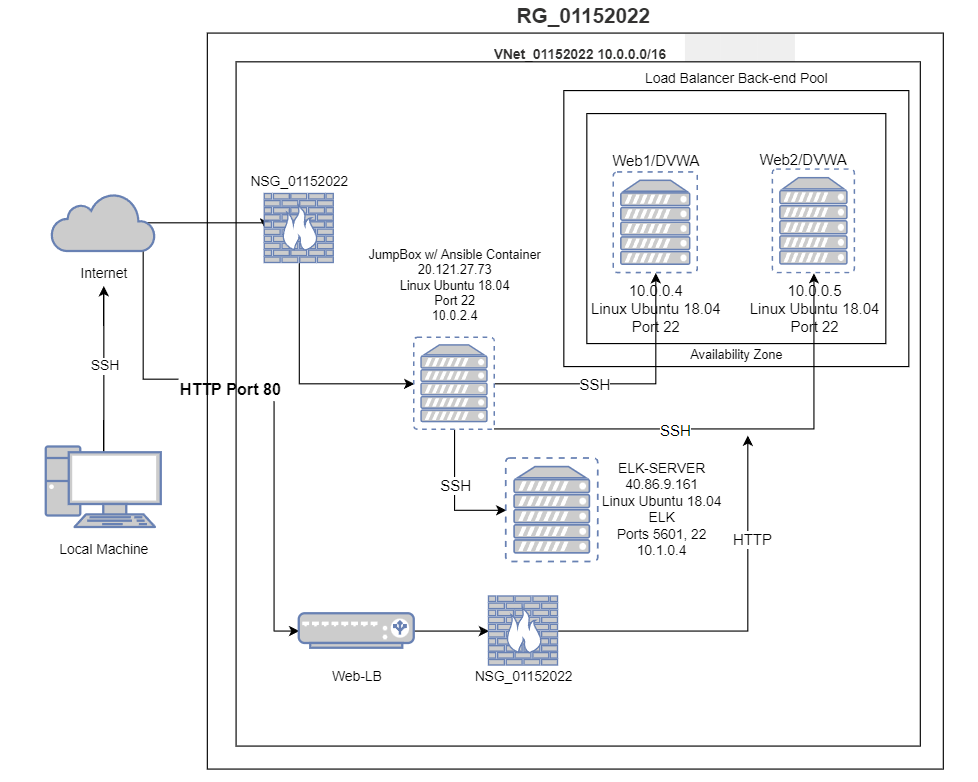
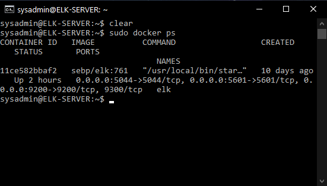

## Automated ELK Stack Deployment

The files in this repository were used to configure the network depicted below.

These files have been tested and used to generate a live ELK deployment on Azure. They can be used to either recreate the entire deployment pictured above. Alternatively, select portions of the playbook file may be used to install only certain pieces of it, such as Filebeat.

  [filebeat-playbook.yml]
  
  [metricbeat-playbook.yml]

This document contains the following details:
- Description of the Topology
- Access Policies
- ELK Configuration
  - Beats in Use
  - Machines Being Monitored
- How to Use the Ansible Build

### Description of the Topology

The main purpose of this network is to expose a load-balanced and monitored instance of DVWA, the D*mn Vulnerable Web Application.

Load balancing ensures that the application will be highly redundant, in addition to restricting access to the network.
- Load balancers protect servers from denial of service attacks. A load balancer distributes traffic amongst the servers. One benefit of using a jump box is that it protects your virtual machines from public exposure.

Integrating an ELK server allows users to easily monitor the vulnerable VMs for changes to the files and system performance.
- Filebeat monitors the log files.
- Metricbeat periodically collects data from the OS and server.

The configuration details of each machine may be found below.
| Name       | Function  | IP Address | Operating System   |
|------------|-----------|------------|--------------------|
| Jumpbox    |  Gateway  | 10.0.2.4   | Linux Ubuntu 18.04 |
| Web1       |     VM    | 10.0.0.4   | Linux Ubuntu 18.04 |
| Web2       |     VM    | 10.0.0.5   | Linux Ubuntu 18.04 |
| ELK Server | ELK Stack | 10.1.0.4   | Linux Ubuntu 18.04 |

### Access Policies

The machines on the internal network are not exposed to the public Internet. 

Only the JumpBox machine can accept connections from the Internet. Access to this machine is only allowed from the following IP addresses:
- 172.223.175.90

Machines within the network can only be accessed by Port 22.
- JumpBox 10.0.2.4

A summary of the access policies in place can be found in the table below.

|    Name    | Publicly Accesable | Allowed IP Address |
|------------|--------------------|--------------------|
|   JumpBox  |         No         |   172.223.175.90   |
|  DVWA-VMs  |         No         |      10.0.2.4      |
| ELK Server |         No         |      10.0.2.4      |

### Elk Configuration

Ansible was used to automate configuration of the ELK machine. No configuration was performed manually, which is advantageous because...
- Ansible runs from the command line and will allow provisioning scripts to run indentically anywhere and saves a lot of time.

The playbook implements the following tasks:
- Change the memory on the ELK VM
- Install docker.io
- Install python-pip
- Install docker python module
- Downlaod and launch a docker ELK stack

The following screenshot displays the result of running `docker ps` after successfully configuring the ELK instance.

### Target Machines & Beats
This ELK server is configured to monitor the following machines:
- Web1 10.0.0.4
- Web2 10.0.0.5

We have installed the following Beats on these machines:
- Filebeat 7.4.0 amd64.deb
- Metricbeat 7.6.1 amd64.deb

These Beats allow us to collect the following information from each machine:
- Filebeat is used to send log files to Kibana. Filebeat monitors and collects log events on our specified servers.
- Metricbeat helps monitor our servers by collecting metrics from the system and services running on them.

### Using the Playbook
In order to use the playbook, you will need to have an Ansible control node already configured. Assuming you have such a control node provisioned: 

SSH into the control node and follow the steps below:
- Copy the filebeat-config.yml and metricbeat.config.yml files to the ELK VM.
- Update the hosts file to include your webservers IP addresses. 10.0.0.4/10.0.0.5
- Run the playbooks, and navigate to Kibana to check that the installation worked as expected.

- You can download and copy different files for your elastic playbooks at https://www.elastic.co/downloads/ 
- After you have configured the hosts file to have a [webserver] and [elk] group, you can specify which one you want to run a playbook on by editing the "hosts" line in the playbook.
- You can navigate to http://elk.server.ip.address/setup.php to ensure it up and running.
